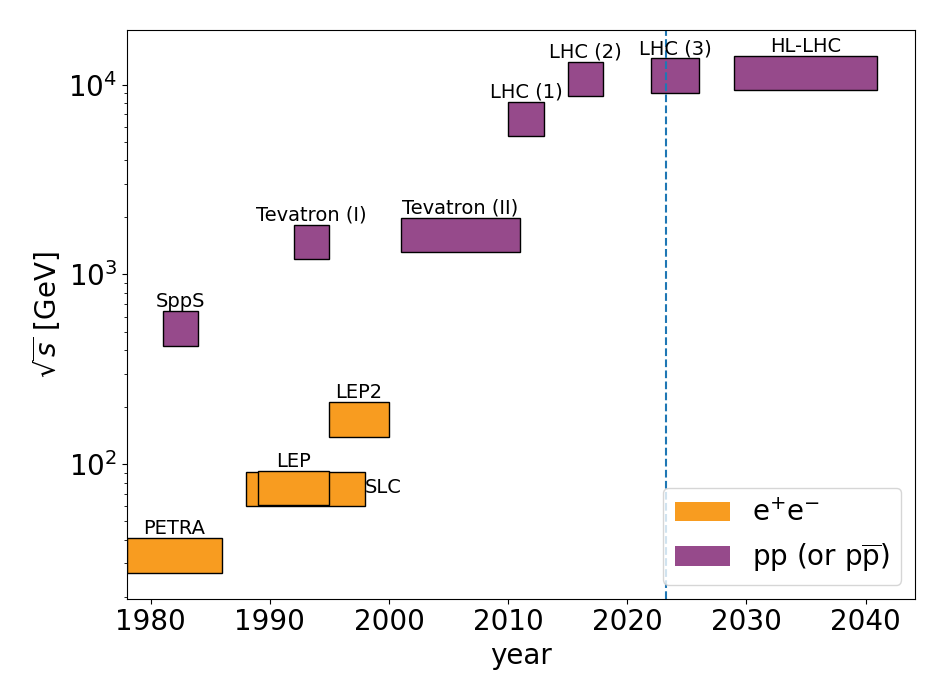

# Collider Timelines

A simple package to generate nice-looking timelines of collider operation.

# Usage

```shell
python timeline.py [options]
```

## Options

* `-C, --colliders [file]`: name of colliders config file (default: current)
* `-S, --style [file]`: name of style file (default: style)
* `-o, --output [name]`: name for output image file(s) (default: colliders)
* `-f, --format [format [format] ...]`: format(s) for output image files (default: ['pdf', 'png'])
* `-l, --livingston`: Livingston plot style: show s/(2m_proton) instead of sqrt(s) (default: False)
* `--liny`: use linear y scale (default: False)
* `-h, --help`: show this help message and exit

# Examples



# Dependencies

Tested with Python 3.8.10 and Matplotlib 3.6.2.
May work with other versions.
